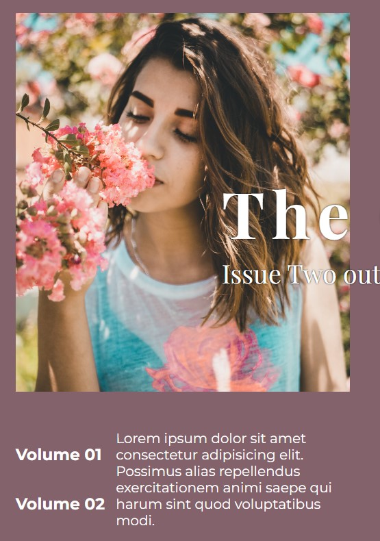

#                               INDEX

1. [Transform](#1-transform)
1. [Transition](#2-transition)
1. [Center Any Data](#3-center-any-data)
1. [After & Before](#4-after--before)
1. [Align Text with Image](#5-align-text-with-image)
1. [Large No. of Words in Single Line](#6-large-no-of-words-in-single-line)
1. [User Can't Select the Text](#7-user-cant-select-the-text)
1. [](#)
1. [](#)
1. [](#)


# 1. transform

- translate
    - **translate(x, y)**: Moves the element by x (horizontal) and y (vertical) units.
    - **translateX(x)**: Moves the element horizontally by x units.
    - **translateY(y)**: Moves the element vertically by y units.
    - **translateZ(z)**: Moves the element along the Z-axis by z units (3D transformations).
    - **translate3d(x, y, z)**: Moves the element by x, y, and z units (3D transformations).

- scale
    - **scale(x, y)**: Scales the element by x (horizontal) and y (vertical) factors.
    - **scaleX(x)**: Scales the element horizontally by x factor.
    - **scaleY(y)**: Scales the element vertically by y factor.
    - **scaleZ(z)**: Scales the element along the Z-axis by z factor (3D transformations).
    - **scale3d(x, y, z)**: Scales the element by x, y, and z factors (3D transformations).

- rotate
    - **rotate(angle)**: Rotates the element by angle degrees.
    - **rotateX(angle)**: Rotates the element around the X-axis by angle degrees (3D transformations).
    - **rotateY(angle)**: Rotates the element around the Y-axis by angle degrees (3D transformations).
    - **rotateZ(angle)**: Rotates the element around the Z-axis by angle degrees (3D transformations).
    - **rotate3d(x, y, z, angle)**: Rotates the element around a vector defined by (x, y, z) by angle degrees (3D transformations).

- skew
    - **skew(x-angle, y-angle)**: Skews the element by x-angle degrees horizontally and y-angle degrees vertically.
    - **skewX(x-angle)**: Skews the element horizontally by x-angle degrees.
    - **skewY(y-angle)**: Skews the element vertically by y-angle degrees.

- matrix
    - **matrix(a, b, c, d, e, f)**: Applies a 2D transformation matrix to the element.
    - **matrix3d(a1, b1, c1, d1, a2, b2, c2, d2, a3, b3, c3, d3, a4, b4, c4, d4)**: Applies a 3D transformation matrix to the element.


```css
.element {
    transform: translate(50px, 100px) scale(1.5) rotate(45deg) skew(10deg, 20deg);
}
```

This example moves the element 50px to the right and 100px down, scales it by 1.5 times, rotates it 45 degrees, and skews it by 10 degrees horizontally and 20 degrees vertically.


# 2. transition

It allows you to smoothly change the value of a CSS property over a specified duration. It is often used to create animations and visual effects without the need for keyframes. 

### Properties of transition


- transition-property:

    - Specifies the name of the CSS property the transition effect is for.
    - Example: transition-property: width, height;

- transition-duration:

    - Specifies how long the transition should take to complete.
    - Example: transition-duration: 2s; (2 seconds)

- transition-timing-function:

    - Specifies the speed curve of the transition effect.
Common values include linear, ease, ease-in, ease-out, ease-in-out, cubic-bezier(n,n,n,n).
    - Example: transition-timing-function: ease-in-out;

- transition-delay:

    - Specifies a delay before the transition starts.
    - Example: transition-delay: 0.5s; (0.5 seconds)

- Shorthand transition Property

You can also use the shorthand transition property to specify multiple transition properties in a single line. 

The order is:
```css
transition: [transition-property] [transition-duration] [transition-timing-function] [transition-delay];
```

Eg :
```css
.box {
    width: 100px;
    height: 100px;
    background-color: red;
    transition: width 2s ease-in 1s, height 1s linear 0.5s, background-color 1.5s ease-out 2s;
}

.box:hover {
    width: 200px;
    height: 200px;
    background-color: blue;
}
```

* [transition-property] - width  
* [transition-duration] - 2s
* [transition-timing-function] - ease-in 
* [transition-delay] - 1s


Eg :
```css
.box {
    width: 100px;
    height: 100px;
    background-color: red;
    transition: width 2s, height 2s, background-color 2s;
}

.box:hover {
    width: 200px;
    height: 200px;
    background-color: blue;
}
```

* [transition-property] - width  
* [transition-duration] - 2s


Eg :
```css
.box {
    width: 100px;
    height: 100px;
    background-color: red;
    transition-property: width, height, background-color;
    transition-duration: 2s, 1s, 1.5s;
    transition-timing-function: ease-in, linear, ease-out;
    transition-delay: 1s, 0.5s, 2s;
}

.box:hover {
    width: 200px;
    height: 200px;
    background-color: blue;
}

```


# 3. Center Any Data

There are many method to center an item. But it depend on situation what method has to be used.

Method 1 :
```css
display: flex;
align-item: center;
justify-content: center;
```

Method 2 :
```css
width: max-content;
margin: 0 auto;
```

Reason for `width: max-content;` is that width of the element which has to be centered must be fixed / defined.

Method 3 :
```css
position: absolute;
top: 50%;
left: 50%;

transform: translate(-50%, -50%);
```

Concept : 
```css
position: absolute;
top: 50%;
left: 50%;
```
This code center the whole element means the top-left corner of element is at center not the element. As to center the element we want the center of element to be at center not the top-left corner.

So to bring top-left corner at center we use 
```css
transform: translate(-50%, -50%);
```
As this code move the element ''left'' by 50% of it's width and "top" by 50% of it's height. So that the element can come at center.


Note: As if we add an icon in an element and increase it's font size, we can't center it with method 3 but we can use other methods like ``text-align: center;``


# 4. After & Before

To use After & Before we must use `content`

Eg :
```css
a::before{
    content: "";
    /* Code */
}
```

We can also add some value in `content` like 
Eg :
```css
a::before{
    content: "*";
    /* Code */
}
```


# 5. Align Text with Image
If we need to align Image and text like




Method 1 :
Make a `Div` give it a background image and make the div `relative` and make one more div inside it which has text and adjust it down the image by making it `absolute` and adjust it by `top` value.

It help when we make it responsive as with this method image and text will remain align no matter how much text is added


Method 2 :
We can make 1 main `div` containing 2 `div` and the we can give image to 1 div and text to other div.

# 6. Large No. of Words in Single Line

If we have a large sentence which goes in 2 or more lines and we want to bring it in 1 line we can use `white-space` property with value `nowrap`

```css
white-space: wrap;
```

# 7. User Can't Select the Text

If we want to prevent some thing from selecting by use we can use `user-select` property with value none.

```css
user-select: none;
```

# 8. 


# 


# 


# 

