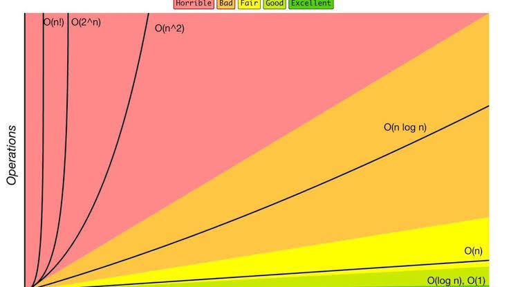

<link rel="stylesheet" href="../style.css">

# Q1- What is Big O Notation?
Ans- Imagine we have multiple implementaions of the same function & want to detemine which when is best, we use Big O Notation.

Big O Notation has 2 types of finding 
Time Complexity & Space Complexity.
<br>
<br>
In Big O Notation, there are six major types of complexities (time and space):

   1. Constant - **O(1)**
   2. Linear time - **O(n)**
   3. Logarithmic time - **O(n log n)**
   4. Quadratic time - **O(n^2)**
   5. Exponential time - **O(2^n)**
   6. Factorial time - **O(n!)**
<br>

Function is quality is devide in 5 types

   1. Excellent/Best  - **O(1)**  
   2. Good  - **O(log n)**  
   3. Fair  - **O(n)**  
   4. Bad  - **O(n log n)**  
   5. Horrible/Worst - **O(n<sup>2</sup>), O(2<sup>n</sup>) and O(n!)**  

   <div class="note">In Big O Notation, base of log not matters as what ever the base of log is, Big O Notation graph remain same. </div>
<br>
<br>

   

<br>
<br>

Eg: We want to write a function that calculates the sum of all numbers from 1 up to n.

Method 1
```javascript 
function addUpTo(n){
    let total = 0;
    for(let i = 1 ; i <= n; i++){
        total += i;
    }
    return total;
}
```

Method 2
```javascript
function addUpTo(n){
    return n * (n + 1) / 2;
}
```

<br>
<br>
<br>


# Q2- Why use Big O Notation than find run Time of code?


Code for calculating Completion Time of a code.
```javascript
let t1 = performance.now();
// Code or function whose time you want to find
addUpTo(1000000000);
let t2 = performance.now();
console.log(`Time Elapsed: ${(t2 - t1) / 1000} seconds. `)
```

But Problem with Time is that it differ from machine to machine and sometimes same machine also records different time for same function, so we use number of simple operations the computer perform.

```javascript
function addUpTo(n){
    return n * (n + 1) / 2;
}
```
As this has 3 operations .

In Big O Notation, when number of operation is constant then result is **O(1)**


```javascript 
function addUpTo(n){
    let total = 0;
    for(let i = 1 ; i <= n; i++){
        total += i;
    }
    return total;
}
```
In this main operation is only 1 but it depend on the "n" so as n ↑ number of operation ↑

In Big O Notation, when number of operation is depending on "n" then result is **O(n)**

If loops are written differently then result of Big O Notation will be O(n)

```javascript
function countUpAndDown(n) {
console.log("Going up!");
for (let i = 0; i < n; i++) {
console.log(i);
}

console.log("At the top! \n Going down...");
for (let j = n - 1; j = 0; j--) {
console.log(j);
}

console.log("Back down. Bye!");
}
```

If loops are written in nested form then result of Big O Notation will be O(n<sup>2</sup>)  

<div class="note">
📖 Note: 
<br>2 because number of loops are 2. 
<br>means power of n depend upon number of loops.
</div>

```javascript
function printAllPairs(n) {
for (var i = 0; i < n; i++) {
for (var j = 0; j < n; j++) {
console.log(i, j); }
}}
```
<br>
<br>
<br>

<div class="remember">
<p><strong>💡 Point To Remember</strong></p>
<table style="display: flex; align-item: center; justify-content: center;">
            <tr>
                <th>WRONG</th>
                <th>RIGHT</th>
            </tr>
            <tr>
                <td>O(2n)</td>
                <td>O(n)</td>
            </tr>
            <tr>
                <td>O(500)</td>
                <td>O(1)</td>
            </tr>
            <tr>
                <td>O(13n<sup>2</sup>)</td>
                <td>O(n<sup>2</sup>)</td>
            </tr>
            <tr>
                <td>O(n + 10)</td>
                <td>O(n)</td>
            </tr>
            <tr>
                <td>O(12n<sub>2</sub> + 5n + 8)</td>
                <td>O(n<sub>2</sub>)</td>
            </tr>
</table>

1. Arithmetic operations are constant
2. Variable assignment is constant
3. Accessing elements in an array (by index) or object (by key) is constant
4. In a loop, the the complexity is the length of the loop times the complexity of whatever happens inside of the loop

</div>


# Q3- Define Space Complexity?
Ans- Space Complexity refers to space required by the algorithm, not including space taken up by the inputs.Sometimes this space is also called **auxiliary space complexity**.

<div class="note">
📖 Note: 

1. Most primitives (booleans, numbers, undefined, null) are constant space.
2. Strings require O(n) space (where n is the string length).
3. Reference types are generally O(n), where n is the length (for arrays) or the number of keys (for objects).

</div>
<br>

Space taken by code depend on number of operator which take part in assigning value not on number of operator which take part in calculation.
```javascript
function sum(arr) {
let total = 0;
for (let i = 0; i < arr.length; i++) {
total += arr[i];
}
return total;
}
```
here number of operators which get counted in Space Complexity is 2 so **O(1)**.

```javascript
function double(arr) {
let newArr = [];
for (leti = 0; i < arr.length; i++){
newArr.push(2 * arr[i]);
}
return newArr;
}
```
here number of operators which get counted in Space Complexity is depending on input so **O(n)**.

<br>
<br>
<br>


# Q4- Object & Array through lens of Big O Notation?
Ans- When to use object  
- When you don't need order 
- When you need fast access / insertion & removal.

<br>

As time for object is less than array in fellowing mehods :-
1. Insertion  - **O(1)**
2. Removal - **O(1)**
3. Searching - **O(n)**
4. Access - **O(1)**

<br>

Big O Object Methods
1. Object.keys - **O(n)**
2. Object.values - **O(n)**
3. Object.entries - **O(n)**
4. hasOwnProperty - **O(1)**

<br>

When to use array  
- When you need order 
- when you need fast access / insertion & removal (sort of...).

<br>

Result for array:-
1. Insertion  - **It depends on input**
2. Removal - **It depends on input**
3. Searching - **O(n)**
4. Access - **O(1)**

<br>

Big O Array Methods
1. push - **O(1)**
2. pop - **O(1)**
3. shift - **O(N)**
4. unshift - **O(N)**
5. concat - **O(N)**
6. slice - **O(N)**
7. splice - **O(N)**
8. sort - **O(N * log N)**
9. forEach/map/filter/reduce/etc. - **O(N)**